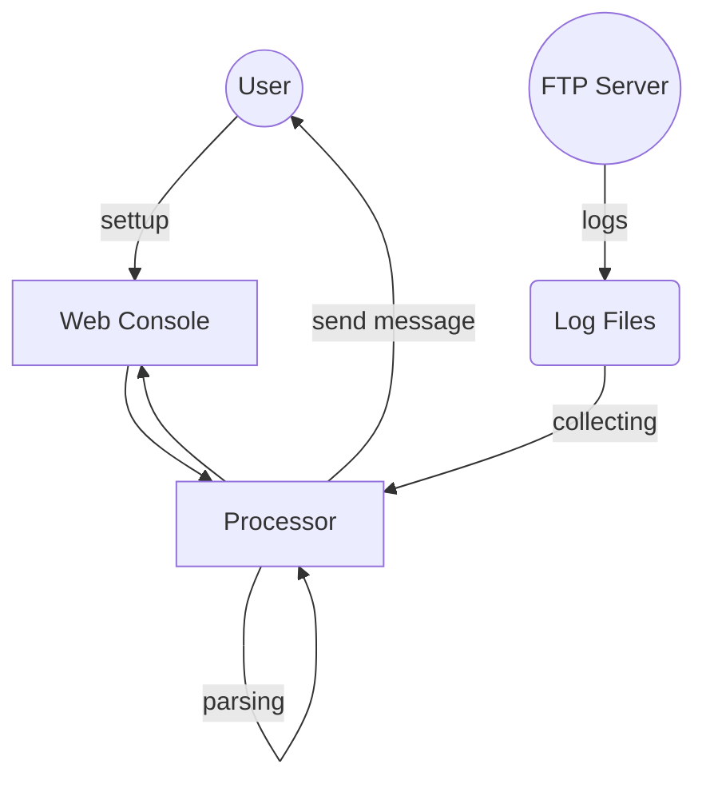

# FTP 로그 분석 및 알림(가칭)

- 작성: 홍현준, llane@gscdn.com
- 검수: 도준호, june26@gscdn.com
- 개정이력:
  - 2017-05-18 최초작성
  - 2017-05-22 내부검수

---

[TOC]

## TL;DR

* FTP 로그 분석을 통해 접근 계정과 이벤트를 감시하기 위한 솔루션 제공

## Intro

### 목적

본 소프트웨어는 FTP 로그 분석을 통해 접근 계정과 이벤트를 감시하기 위한 기능을 제공한다.

### 범위

- FTP 로그 데이터를 분석한다.
- 데이터 분석을 통해 특정 이벤트 시 알람을 발생한다.
- 실시간으로 알람 정보를 수신자에게 전달한다.

### 제약

- 분석 대상은 단일 서버로 한정하며 다수의 서버에 대한 통합적인 모니터링은 고려하지 않는다.
- 본 소프트웨어는 폐쇄망에서 사용되는 운영 도구로서 보안적인 고려는 최소화 한다.

## 소프트웨어

### 배경

일부 사용자의 FTP 서비스 보안 강화 요청에 따라 FTP 서버의 접근 감시 및 이벤트 관제에 필요한 최소한의 정보를 제공하기 위한 소프트웨어를 개발한다. 

### 주요 기능

1. **이벤트 감지:** 로그 파일을 분석하여 이벤트를 감지한다.
2. **이벤트 통보:** 지정된 이벤트 발생 시 지정된 사용자에게 통지한다.
3. **설정:** 웹 인터페이스를 통해 통지 메시지를 전달 받을 수신자를 설정한다.
4. (옵션)이벤트 열람: 이벤트 히스토리 확인을 위한 UI를 제공한다.

### 사용자

- 1차 대상: GS네오텍 CDN 운영자
  - FTP 서버 및 소프트웨어 관리 담당자
- 2차 대상: 대상 고객사
  - 메시지 전달 대상

### 운영 환경

- **OS:** 리눅스
- **네트워크:** 폐쇄망 내 제한된 관리자만 접근 가능

### 설계 및 구현 제약

- 분석 대상
  - VSFTP의 로그로 한정
- 이벤트 대상
  - 접속, 접속해제
  - 파일 변경(추가, 변경, 삭제)
- 알람 메시지 수신 방식
  - Email을 통한 수신(Default)
  - Slack 서비스 연동
    - 기능적인 검토 필요

## 사용 시나리오

### 01. 이벤트 메시지 수신 On/Off

1. 웹 인터페이스 접속
2. 메시지 전송 On/Off 설정
3. 확인

### 02. 이벤트 메시지 수신자 설정

1. 웹 인터페이스 접속
2. 수신자 추가
3. 수신자 정보 입력
   1. Email 입력
   2. (옵션) Slack ID
4. 확인

## 인터페이스

### 사용자 UX

소프트웨어 내장 Web UI 제공

### 외부 시스템

- VSFTP
  - 대상 분석 대상으로 지정된 경로에 로그파일을 적재한다.
- Email
  - 기본적인 통지 방식
- (옵션) Slack
  - 메시지앱으로 기능 분석에 따라 연동 여부 판단

## 비기능적 요구

### 성능

- 메시지 전송 실시간 처리
  - **실시간:** 이벤트 탐지 후 5분 이내 메시지 전송
- 분석 데이터 처리량 기준
  - 일일 최대 50MB 기준
  - 초당 1KB 이상 처리 보장
- 이벤트 히스토리 유지 기간
  - 최대 7일간 유지

### 비용

- 물리적인 H/W 유지 비용 발생 가능

### 안전

- HA 구성은 고려 하지 않음
- 중복 프로세스를 방지하기 위한 최소한의 안정장치 필요

### 보안

- 개인정보 암호화
  - 연락처, 비밀번호, Email, (옵션)Slack ID
- 네트워크 보안
  - 기본적으로 폐쇄망을 상정
  - IP기준 접근 제어 필요(ACL)
- 접근 통제
  - 별도 계정 정책은 수립하지 않음
  - 네트워크 보안에 의거 관리자 IP만 허용하는 것으로 대체

### 유지보수

- 업무 범위
  - 소프트웨어 개발 및 배포 환경 구축
  - 소프트웨어 사용자 가이드 작성 및 Q&A
  - 소프트웨어 기능 추가 및 변경
    - 개발 완료 이후 1개월 이내 요청사항에 한정
    - 정의된 기능 범위 외 항목은 별도 협의
  - 소프트웨어 오류 수정
    - 개발 완료 이후 1년 이내 확인된 오류에 한정
- 업무 외 범위
  - 소프트웨어 적용
    - 일반적인 사용에 필요한 절차
    - 설치, 백업, 이관 등
  - 소프트웨어 성능 및 장애 감시
    - 성능 및 장애 감시와 복구를 위한 절차
    - 모니터링, 관제, 서비스장애 복구 및 보고 등
- 유지보수 기한
  - 소프트웨어의 유지보수 기한 만료는 1년을 기준으로 한다.
  - 만료 시 내구연한 및 가동률을 산정하여 기한 갱신 혹은 폐기를 시행한다.

## 기타 이슈

- 옵션 사항인 Slack 연동은 기능적인 검토 후 제공 여부 판단
- 예외상황으로 인한 대량 메시지 전송이 발생 할 수 있음
  - 메시지 통합 혹은 축약에 대한 고려 필요
- 웹인터페이스 접속을 위한 도메인 할당이 필요할 수 있음

## Reference

* ​